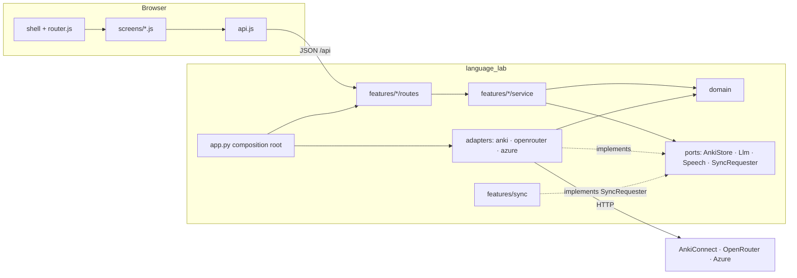
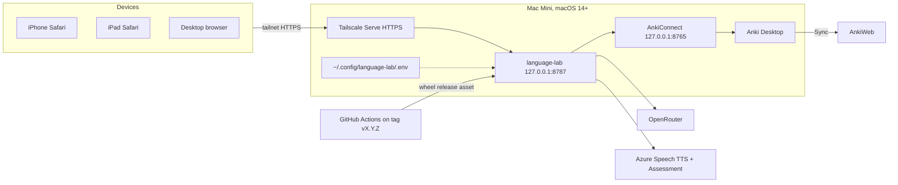

# Architecture Spine — LanguageLab

## Design Paradigm

**Backend: hexagonal, sliced by feature.** Each feature module owns its use cases and HTTP routes. The external systems sit behind ports, and exactly one adapter implements each port. `app.py` is the composition root and the only place adapters are constructed and injected.

**Client: static shell + JSON API.** FastAPI serves one HTML shell and plain ES modules from the wheel. The browser routes with real paths and renders. All data moves through `/api`.



Dependency rule: `routes → service → {ports, domain}`. Adapters depend on `ports` and `domain` only. Features never import adapters or another feature's internals. Anything shared across features lives in `domain/` or behind a port.

## Invariants & Rules

### AD-1 — Ports speak domain, adapters own the wire [ADOPTED]

- **Binds:** all backend features; NFR-6
- **Prevents:** features calling AnkiConnect, OpenRouter, or Azure directly, or leaking deck strings, field names, and Anki ids into feature code.
- **Rule:** Only `adapters/anki` issues AnkiConnect requests, only `adapters/openrouter` calls OpenRouter, and only `adapters/azure` calls Azure. Ports (`AnkiStore`, `Llm`, `Speech`, `SyncRequester`) take and return `domain` types. They never take Anki field names, deck names, note ids, or card ids. Every port has an in-memory fake in `tests/fakes/`, kept in step with the port.

### AD-2 — Anki is the only persistent store [ADOPTED]

- **Binds:** all; NFR-2, FR-22, FR-35
- **Prevents:** a feature adding a local database, cache file, or on-disk temp store that drifts from Anki or retains pronunciation data.
- **Rule:** The backend writes nothing to disk. In-memory runtime state is limited to:
  - configuration;
  - the Anki lock;
  - the Sync scheduler and its last status;
  - `SetupState` (AD-19);
  - the Azure Voice catalog cache.

  Item, Capture, Draft, Preview, recording, and Assessment content is never held beyond the request that carries it. The only browser persistence is the Voice preference (AD-13).

### AD-3 — The managed manifest is the single source of Anki names and structure

- **Binds:** setup, captures, items, pronunciation; FR-6, FR-7, FR-8, FR-20, addendum A3
- **Prevents:** two features spelling a deck, note type, field, preset, or card ordinal differently, and Setup diverging from what features write.
- **Rule:**
  - **Ownership.** The Setup epic owns `adapters/anki/manifest.py`. Other epics change it only by amending this spine.
  - **Contents.** The manifest declares the whole managed structure, every name derived from `ANKI_PREFIX`:
    - the five note types and their fields, including hidden `ItemId`/`CaptureId` and `SchemaVersion`;
    - template and CSS files packaged under `adapters/anki/templates/`;
    - the deck tree;
    - the current `SchemaVersion`;
    - the fixed card ordinal → Exercise → deck mapping: ord 0 Understand, 1 Produce, 2 Write, 3 Pronounce.
  - **Deck-options preset.** The manifest owns exactly one preset, named `<Prefix>`, assigned to every managed Study **and** Pronunciation deck. Setup sets only its three sibling-burying flags to off and leaves every other option to the user (FR-8).
  - **Setup flow.** Setup is `diff(manifest, Anki) → plan (preview, with a plan hash) → apply → verify`. Apply proceeds only if a fresh diff still hashes to the confirmed plan. Once started, it runs to completion server-side even if the client disconnects. Plan steps that change a note type's fields are flagged *requires full sync*. Setup runs a Sync before applying them and tells the user to complete the one-way upload in Anki Desktop.
  - **SchemaVersion.** `SchemaVersion` bumps only when note types, fields, or the deck tree change. A template- or CSS-only change is repaired by diff without a bump. A migration is an ordered step keyed by `SchemaVersion` and runs only inside a confirmed plan, never at startup. Only migrations rewrite a note's `SchemaVersion`.
  - **Unrecognized content.** Setup reports content under the Prefix that the manifest doesn't recognize and never changes it automatically. That covers non-managed notes and decks, misplaced or unsuspended managed cards, and orphan media. Orphan media is a managed media file that no note's `Audio` field references. Each repair is an explicit plan item.

### AD-4 — The Prefix boundary is enforced in one place [ADOPTED]

- **Binds:** all Anki writes and queries; NFR-1
- **Prevents:** a feature writing outside the Prefix through a hand-built query or name, user text altering a search's scope, and one Prefix matching another (`LanguageLab` vs `LanguageLabDev`).
- **Rule:**
  - **Prefix validation.** `ANKI_PREFIX` must match `^[A-Za-z][A-Za-z0-9]*$`, or startup fails.
  - **Writes.** The Anki adapter rejects any write, delete, move, preset, or media operation whose target isn't a manifest resource, a note of a manifest note type, the `<Prefix>` preset, or a media file matching AD-7. It checks this itself rather than trusting callers.
  - **Queries.** Every query the adapter builds uses exact scopes: `deck:"<Prefix>::<path>"` or `deck:"<Prefix>"` (which includes children), and an exact `note:"<note type>"`. It never uses a wildcard on the Prefix. User text never enters an Anki search string; filtering on user input happens in the service (AD-12).

### AD-5 — One global Anki lock, bounded in time; a use case is the unit

- **Binds:** all features using `AnkiStore`, sync; FR-36, NFR-3
- **Prevents:** a Sync or second-device request interleaving inside another request's multi-step write, and a hung Sync or Anki dialog blocking all work.
- **Rule:** One in-process `asyncio.Lock` in the Anki adapter, for one process only.
  - **Unit of work.** Every `AnkiStore` method runs entirely under the lock and is one complete use case. Services never hold the lock across calls to another port, so LLM and Azure calls happen outside it.
  - **Timeouts.** Every AnkiConnect request has a timeout: 10 s by default, 120 s for `sync`. Waiting for the lock is capped at 15 s and then returns `anki_busy`.
  - **Pronunciation start.** Session start reads the first card before it requests the pre-session Sync.

### AD-6 — Multi-step writes order themselves so failure is never lossy [ADOPTED]

- **Binds:** items, captures; NFR-3, FR-23, FR-25, FR-28
- **Prevents:** a failed Save destroying the prior field or audio value, or features choosing different write orders or initial decks.
- **Rule:** Only Items Save and Items Delete touch an Item's `Audio` field or its media. Save takes `audio: keep | replace | remove`. Each multi-step write follows a fixed order and makes no inline compensation on failure:

  | Use case | Order |
  | --- | --- |
  | Save Item (`replace`) | (1) store the new media file → (2) add or update the note (new notes go into their Language/Category **Pronunciation** deck with `allowDuplicate: true`) → (3) for a new note, move cards 0–2 to their Study decks → (4) delete the superseded media file, if its name differs from the new one |
  | Save Item (`keep` / `remove`) | Same order, skipping step 1 |
  | Create Capture | add the note (`allowDuplicate: true`) → suspend its card |
  | Delete Item | delete the note → delete every media file matching `<Prefix>_<ItemId>_*` |

  A failure at any step stops the sequence and returns an error. The prior note and media stay untouched until the note write succeeds. Leftovers from a partial failure are tolerated, and Setup reports and repairs them (AD-3). The Pronunciation queue selects only ord-3 cards in the Language's Pronunciation decks (`is:due` or `is:new`, not suspended). That way a card left behind by a failed move never enters the queue.

### AD-7 — Managed media names are deterministic; one route serves them

- **Binds:** items, audio, setup; FR-28, FR-25, FR-31
- **Prevents:** per-feature naming that makes managed-media and orphan detection impossible without a database, and several endpoints serving audio.
- **Rule:**
  - **Naming.** Every managed media file is named `<Prefix>_<ItemId>_<sha256[:12] of bytes>.mp3`, with the hash computed by the backend from the bytes it receives. A media file is managed if and only if its name matches this pattern.
  - **`Audio` field.** It holds exactly `[sound:<name>]` or is empty.
  - **Serving.** Stored audio is served only by `GET /api/media/<name>`, which rejects any non-managed name.

### AD-8 — ItemId and CaptureId are UUIDv4 identities

- **Binds:** captures, items, drafts, audio, pronunciation, client routes; amends addendum A3 (adds hidden `CaptureId` to the Capture note)
- **Prevents:** some units keying entities by Anki ids and others by app ids, and a retried create minting a second note.
- **Rule:**
  - **Format.** `ItemId` and `CaptureId` are UUIDv4 in lowercase canonical form, immutable once stored. They are the only identifiers in the API, URLs, media names, and domain types. Anki note and card ids stay inside the Anki adapter.
  - **ItemId.** Issued by the backend when a Draft is created, whether generated or blank, and carried by the Draft until Save.
  - **CaptureId.** Generated by the client when it composes a Capture.

### AD-9 — Anki fields hold escaped plain text

- **Binds:** Anki adapter, all features reading or writing fields; FR-19, FR-21, FR-22, FR-23
- **Prevents:** one feature storing HTML and another raw text, quote entities breaking Write typing comparison, or Anki-editor markup leaking into the UI or the duplicate check.
- **Rule:** One codec in `adapters/anki/codec.py`; no other code converts field content.
  - **Write.** Escape only `&`, `<`, and `>`, and turn `\n` into `<br>`. Add no other markup.
  - **Read.** Turn `<br>` and block tags into `\n`, strip all other tags, unescape, and replace NBSP with a space. Domain values are always plain text.

### AD-10 — Russian meaning is two fields (amends addendum A3)

- **Binds:** items, drafts, templates; FR-14, FR-15, FR-21
- **Prevents:** Produce/Write fronts showing alternatives, or units inventing their own delimiter.
- **Rule:** Vocabulary and Sentence note types carry two fields:
  - `Russian` holds the primary meaning only. It appears on the Produce/Write fronts and on every back.
  - `RussianAlternatives` is optional, shown on the back only, and never parsed by templates.

  The domain carries `russian: str` and `russianAlternatives: list[str]`. An alternative may not contain a comma (domain validation). Only the Anki adapter joins the list with `, ` and splits it.

### AD-11 — Items owns one content type, and one strict schema per Category drives generation and Save

- **Binds:** drafts, items; FR-14 to FR-18, FR-24
- **Prevents:** Draft, Save, and Item-read payloads having different shapes, and the generation schema drifting from the validators, which would let malformed content be saved.
- **Rule:**
  - **Content type.** The Items epic owns `domain/items.py`. It defines `ItemContent`, a flat Pydantic union discriminated by `category`, used unchanged by Draft responses, Save requests, and Item reads.
  - **Generation models.** Per Category, `domain` derives a generated-fields model, a subset of `ItemContent` without `mnemonic` and without Sentence `example`. It is exported by one `strict_json_schema()` that sets `extra="forbid"`, makes every property required, renders optional fields as nullable, and emits no defaults. A test asserts this.
  - **Validation.** The same model validates the LLM response: one retry, then `llm_invalid_output`. Save validates against `ItemContent`.
  - **Regeneration.** Per-field regeneration (FR-24) calls the drafts generation for the Item's Category and returns the full generated model. The client takes the field it needs. No per-field schemas exist.

### AD-12 — Duplicate and search matching use one normalization in the service

- **Binds:** items; FR-19, FR-22, FR-23
- **Prevents:** create and edit flows warning on different matches, and search semantics differing between screens.
- **Rule:**
  - **Normalization.** `domain.normalize_text(text)` applies NFC, casefold, trims surrounding whitespace and Unicode punctuation, collapses inner whitespace to one space, and maps apostrophe variants (`’ ʼ ′ ‘`) to `'`. Diacritics stay significant.
  - **Duplicate check.** A separate Items read (`GET /api/items/<lang>/duplicates?category=&target=`). It compares normalized `Target` against the same Language and Category, excluding the Item's own `ItemId`.
  - **Search.** A normalized substring match over `Target`, `Russian`, and `RussianAlternatives` across both Categories of one Language.
  - **Where matching happens.** In both cases the adapter returns scoped candidates (AD-4), and matching happens in the service.

### AD-13 — Client contract: static shell, real paths, screen-local state, one router

- **Binds:** all screens; FR-3, FR-11, FR-12, FR-22, FR-29, NFR-10, NFR-11
- **Prevents:** mixed routing schemes, Drafts carried or regenerated across screens, per-screen unsaved dialogs, per-screen fetch handling, stale Anki data on screen, and stale assets after an upgrade.
- **Rule:**
  - **Serving and routing.** FastAPI serves `/static/*` with the release version in each asset URL, `/api/*` JSON, and the shell for every other GET path. The client uses History API routing.
  - **Screens.** Each screen is one ES module exporting `mount(root, params) → unmount`. Its state lives only in that module's memory.
  - **Drafts.** The Draft editor is the route `/captures/<captureId>/new`. Its Draft, including `ItemId` and Generation context, exists only there and is never put in the URL, `history.state`, or storage.
  - **Crossing screens.** The only data that crosses screens is `router.navigate(path, { flash: message })`, a one-shot message such as the post-Save banner.
  - **Router.** A single `router.js` owns navigation and unsaved changes. Screens report `router.setDirty(null | {kind, count, target})`. The router alone renders the unsaved alert and owns `beforeunload`. Screens call `router.confirmLeave()` before an in-screen discard or "Open existing", and clear dirty state before navigating after a successful Save.
  - **API calls.** A single `api.js` is the only `fetch` caller. It parses the error envelope (AD-15).
  - **Data freshness.** Screens re-read from the API on every mount and keep no cross-screen data cache.
  - **Voice preference.** `static/voice-pref.js` is the only `localStorage` user, with keys `languagelab.voice.en-US` and `languagelab.voice.fr-CA`.
  - **Third-party code.** Third-party browser code and fonts are vendored under `static/vendor/`; no npm, build step, or CDN.

### AD-14 — Audio flows through the backend; per-locale feedback is shaped server-side

- **Binds:** audio, pronunciation; FR-26 to FR-28, FR-31 to FR-35, NFR-6, A5
- **Prevents:** recordings or Previews being cached, credentials reaching the browser, a client-supplied reference text, and the UI having to censor French feedback.
- **Rule:**
  - **Preview.** `POST /api/audio/preview` synthesizes an MP3 and returns its bytes. The browser holds the Blob and re-uploads it at Save (`audio=replace`). The server keeps no Preview state.
  - **Attempt.** The browser uploads its native MediaRecorder output; on iOS Safari that's `audio/mp4`. One request:
    1. reads the Target text from Anki by `itemId` (never from the client);
    2. converts the recording in memory with PyAV to WAV PCM 16 kHz mono;
    3. calls Azure scripted assessment;
    4. returns a `domain.Assessment`.

    Nothing is retained, and the browser drops its recording Blob after a Rating or when the review is abandoned.
  - **Limits.** The recorder auto-stops at 30 s. Uploads are capped at 5 MB.
  - **Per-locale shaping.** `domain.Assessment` is shaped per locale in the domain:
    - `en-US` requests the IPA phoneme alphabet and prosody.
    - `fr-CA` drops phoneme labels and keeps only overall, word, and position scores. Start, middle, and end positions are computed by one domain function.
  - **Azure transport.** The REST APIs via `httpx`, not the Speech SDK.

### AD-15 — One error envelope and content-free logs [ADOPTED]

- **Binds:** all routes, `api.js`; PRD §5.2, NFR-7, NFR-9
- **Prevents:** endpoints returning different error shapes, and content leaking into logs through access logs, validation errors, or tracebacks.
- **Rule:**
  - **Envelope.** Every non-2xx `/api` response is `{"error": {"code", "message", "requestId", "details"?}}`.
  - **Codes.** `code` comes from one enum in `domain/errors.py`: `anki_unavailable`, `anki_busy`, `llm_failed`, `llm_invalid_output`, `tts_failed`, `assessment_failed`, `validation_failed`, `not_found`, `forbidden_origin`, `setup_required`, `payload_too_large`, `internal_error`.
  - **Exception mapping.** Exception handlers map everything, including request-validation errors, to the envelope without echoing input values.
  - **Logging.** The uvicorn access log is disabled. Middleware assigns a `requestId` and logs one line per request: request id, method, route template, status, error code, and duration. Logs never carry field values, query strings, prompts, model output, or audio.

### AD-16 — Localhost bind plus a host allow-list; no login [ADOPTED]

- **Binds:** app; NFR-5, FR-2
- **Prevents:** a web page on the Mac Mini driving or reading LanguageLab through cross-site requests or DNS rebinding, and legitimate tailnet writes being rejected.
- **Rule:**
  - **Bind.** The server binds `LANGUAGE_LAB_HOST` (default `127.0.0.1`) only. Remote access goes through Tailscale Serve.
  - **Allow-list.** The host allow-list contains `127.0.0.1:<port>`, `localhost:<port>`, and the tailnet host, which comes from `LANGUAGE_LAB_PUBLIC_HOST` or is discovered at startup.
  - **Checks.** Every request's effective host (`X-Forwarded-Host` if present, else `Host`) must be on the allow-list. Every non-GET `/api` request must carry an `Origin` whose `host[:port]` is on the allow-list, compared without scheme. Failures return `403 forbidden_origin`.
  - **No login.** There are no accounts, sessions, or CORS.

### AD-17 — The sync feature owns every Sync and coalesces requests

- **Binds:** sync, pronunciation, setup, app lifespan; FR-36
- **Prevents:** features calling Sync directly, duplicate or overlapping Syncs, and a Sync failure blocking work.
- **Rule:** `features/sync` implements the `SyncRequester` port, which `app.py` injects into the features that need it. Requests coalesce: at most one Sync running and one pending.
  - **Triggers.** Sync is requested at startup, every 5 minutes, on Pronunciation session start and end, by Setup (AD-3), and at graceful shutdown (capped at 30 s).
  - **Session endpoints.** Pronunciation owns `POST /api/pronunciation/<lang>/session/start` and `.../end`. Both are idempotent and only request a Sync.
  - **Client signals.** The client sends the end signal on router unmount, on `visibilitychange` to hidden, on `pagehide` via `sendBeacon`, and when the queue is empty. Coalescing makes duplicates harmless.
  - **Failures.** A failure is logged to the terminal and retried at the next trigger. It never fails a request. The last Sync status is kept in memory, and a *full sync required* status is shown in the Setup readiness checks.
  - **Dev mode.** `LANGUAGE_LAB_DEV=1` disables all Sync.

### AD-18 — Configuration is read once, in one place [ADOPTED]

- **Binds:** all; FR-1, FR-17, A2
- **Prevents:** modules reading `os.environ` or the `.env` file themselves, and startup breaking on harmless keys.
- **Rule:**
  - `settings.py` (pydantic-settings, `extra="ignore"`) loads `~/.config/language-lab/.env` once at startup.
  - `OPENROUTER_MODELS` stays a comma-separated list parsed by a validator. The adapter sends it as OpenRouter's `models` fallback array with strict `json_schema` and `provider.require_parameters=true`.
  - Adapters receive their settings when `app.py` constructs them.
  - Every key is documented in `.env.example`. The docs recommend `chmod 600` on the `.env` file.

### AD-19 — SetupState gates writes; an older release never writes a newer schema

- **Binds:** all features writing to Anki, setup; FR-5, FR-6, FR-7
- **Prevents:** features each inventing when to return `setup_required`, and a downgraded release writing notes or fields that don't match a newer schema.
- **Rule:**
  - **States.** The Setup feature computes `SetupState`: `ready`, `needs_setup`, `needs_migration`, or `newer_schema`. It's computed at startup, after every Setup apply, and on each visit to Setup.
  - **Gate.** The Anki adapter checks it. Every non-Setup write returns `409 setup_required` unless the state is `ready`, while reads stay allowed.
  - **Version mismatch.** The adapter refuses to update a note whose `SchemaVersion` differs from the manifest's.
  - **Docs.** The documentation says never to run an older release after a migration.

### AD-20 — Commits are idempotent under retry

- **Binds:** captures, items, pronunciation; FR-9, FR-20, FR-34
- **Prevents:** a timed-out request followed by a retry creating a second Item or Capture, or answering a Pronounce Card twice.
- **Rule:**
  - **Save Item.** It is create-or-update by `ItemId`. If a note with that `ItemId` exists, Save updates it.
  - **Create Capture.** It is create-or-noop by `CaptureId`.
  - **Rating.** A Rating request carries the card's review count (`reps`) as shown to the user. The adapter answers only if Anki's current `reps` still equals it. Otherwise it returns success marked `alreadyAnswered`, and the client loads the next Card.

## Consistency Conventions

| Concern | Convention |
| --- | --- |
| API paths | `/api/<feature>/...`, lowercase kebab-case; language segment `en` / `fr`. Client paths: `/captures`, `/captures/<captureId>`, `/captures/<captureId>/new`, `/en/items`, `/en/items/<itemId>`, `/fr/pronunciation`, `/setup` |
| JSON | camelCase keys (Pydantic alias generator); `Language` `en`/`fr` mapped to locales `en-US`/`fr-CA` only in `domain`; `Category` `vocabulary`/`sentence`; `Rating` `again`/`hard`/`good`/`easy`, mapped to ease 1–4 only in the Anki adapter |
| Times | ISO 8601 UTC with `Z` in API and in the Capture `CreatedAt` field |
| Binary payloads | Raw bytes, never base64 in JSON. Preview returns `audio/mpeg`. Save is `multipart/form-data` with an `item` JSON part (`ItemContent` + `itemId` + `audio` intent) and an optional `audioFile` part. An Attempt is `multipart/form-data` with an `itemId` field and a `recording` part |
| Python | Package `language_lab`; feature modules `features/<feature>/{routes,service}.py`; async throughout; one `httpx.AsyncClient` per adapter |
| Testing | Services are tested against `tests/fakes/` ports, and adapters against recorded HTTP fixtures. No test reaches real Anki, OpenRouter or Azure by default. The FR-2 acceptance run verifies the Host and Origin headers Tailscale Serve sends |
| Glossary | Code, API and UI use PRD §3 terms verbatim; UI copy keeps glossary capitalization (EXPERIENCE.md) |

## Stack

| Name | Version |
| --- | --- |
| Python | 3.14 (`requires-python >=3.14`; uv-managed) |
| FastAPI | 0.143.0 |
| uvicorn | 0.54.0 |
| Pydantic | 2.14.0 |
| pydantic-settings | 2.15.0 |
| python-multipart | 0.0.32 |
| httpx | 0.28.1 |
| av (PyAV, bundled FFmpeg; macOS 14+) | 19.0.1 |
| pytest | 9.1.1 |
| ruff | 0.16.10 |
| uv (build + `uvx` run) | 0.12.24 |
| AnkiConnect | API version 6 |
| GitHub Actions | actions/checkout v7, astral-sh/setup-uv v10, softprops/action-gh-release v3 |

## Structural Seed



**Environments.**

- **Release:** `uvx --from <wheel path or release URL> language-lab` on the Mac Mini, with `ANKI_PREFIX=LanguageLab`.
- **Dev:** `uv run language-lab` with `LANGUAGE_LAB_DEV=1` and a separate Prefix (`LanguageLabDev`) in the same Anki. Sync is off in dev.
- **CI:** tests and `uv build` on each `vX.Y.Z` tag. The version lives in `pyproject.toml`, and the wheel is attached to the GitHub release.
- **Upgrades:** run the new wheel, open Setup, and confirm any migration. Never downgrade after a migration (AD-19).

```text
language-learner/
  pyproject.toml            # version, console script language-lab
  .env.example
  .github/workflows/release.yml
  src/language_lab/
    app.py                  # composition root, lifespan, middleware
    settings.py
    domain/                 # items.py (ItemContent), generation schemas, normalize_text, Assessment, errors
    ports/                  # AnkiStore, Llm, Speech, SyncRequester
    adapters/
      anki/                 # client, manifest, codec, lock, setup-state gate, templates/
      openrouter/
      azure/
    features/
      captures/ items/ drafts/ audio/ pronunciation/ setup/ sync/
    static/                 # index.html shell, router.js, api.js, voice-pref.js, screens/, vendor/, css/
  tests/
    fakes/
  docs/                     # install, Tailscale Serve, keyless-AnkiConnect warning, Prefix study convention, backup, upgrade, model evaluation fixtures (FR-4)
```

## Capability → Architecture Map

| Capability / Area | Lives in | Governed by |
| --- | --- | --- |
| Runtime, access, navigation (FR-1 to FR-4) | `app.py`, `settings.py`, `static/router.js`, `docs/` | AD-13, AD-16, AD-18 |
| Setup, repair, migration (FR-5 to FR-8) | `features/setup`, `adapters/anki/manifest.py` | AD-3, AD-4, AD-5, AD-19 |
| Captures (FR-9 to FR-13) | `features/captures` | AD-1, AD-6, AD-8, AD-20 |
| Draft generation (FR-14 to FR-18) | `features/drafts`, `adapters/openrouter` | AD-11, AD-18 |
| Duplicates and search (FR-19, FR-22) | `features/items`, `domain` | AD-12 |
| Items and Cards (FR-20 to FR-25) | `features/items`, `adapters/anki/templates` | AD-3, AD-6, AD-7, AD-9, AD-10, AD-11, AD-20 |
| Reference audio (FR-26 to FR-29) | `features/audio`, `adapters/azure`, `static/voice-pref.js` | AD-7, AD-13, AD-14 |
| Pronunciation review (FR-30 to FR-35) | `features/pronunciation`, `adapters/azure` | AD-2, AD-5, AD-14, AD-17, AD-20 |
| Sync (FR-36) | `features/sync` | AD-17 |
| Boundary, privacy, logging (NFR-1 to NFR-9) | Anki adapter, middleware | AD-2, AD-4, AD-15, AD-16 |

## Deferred

- **Card template visuals (UX OQ-5).** Template markup and CSS belong to the Items epic. AD-3 fixes where they live, AD-10 which fields they read, and FR-21 what they show.
- **Exact endpoint list beyond the routes named here.** Each feature epic defines its own, following AD-13, AD-15, and the conventions.
- **Pronunciation queue cap (PRD Q4).** No cap in v1. Revisit if the queue feels overwhelming. It would be a `features/pronunciation` change only.
- **Capture search (PRD Q2) and spend guardrails (PRD Q3).** Not in v1. Revisit when the backlog grows or bills surprise.
- **Adapter timeouts other than AnkiConnect.** Local to each adapter. Generation retries exactly once (AD-11), and nothing else retries apart from Sync at its next trigger (AD-17).
- **Azure endpoint form.** Regional endpoint from `AZURE_SPEECH_REGION`, per addendum A2. The adapter decides the details.
- **Live-Anki integration test harness.** Optional, behind an opt-in marker against the dev Prefix. It can be added once adapters exist.
